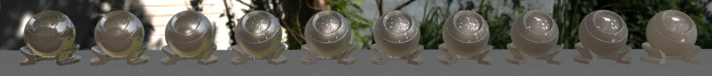

运行需要依赖的外部库 opengl, assimp, glfw, glad, stb_image.h（即learn opengl 里面使用的外部链接库）。

下面是对整个项目的介绍

前言，这个项目主要是使用OpenGL实现了pcf pcss阴影生成，简单的球斜函数(sh)的使用，屏幕空间的反射(ssr/ssrt)，以及一些基于物理的渲染(pbr)，实现了Cook-Torrance模型和Kulla-Conty模型，使用LUT加速方式，IBL等环境光等等。

本人在写这个项目的时候并不是很熟悉OpenGL，所以项目里面的代码封装考虑的并不是很周到，以及一些复用做的不是很好(一个shader能做完的事情硬生成了n个shader)，还有glsl也是一坨，毕竟主要以实现功能为主

下面是总览，后续是各部分的简单介绍。

ShadowMap
pcf 和 pcss

SphericalHarmonics
bilinnPhong 模型

SphericalHarmonics和 bilinnPhong

Screen space reflections
rayMatch in 3DTextureSpace 即在3D的纹理空间里实现
x = [0.0, 1.0] y = [0.0, 1.0] z = [0.0, 1.0]

rayMatch in 3DSpace With DAA 即在世界空间（world Space）里面实现

rayMatch in 2DSpace 即在视图空间（view Space）里面实现,对步长没有任何额外处理（即没有特地调里面的参数），可能步长还是太大了

读了论文后在view Space 一些奇奇怪怪的实现但效果很差

rayMatch in world Space 即在世界空间步长自取(所以效果和性能都不太好,看具体场景具体参数)

Pbr

点光源 GGX NDF  
Cook-Torrance模型 metallic = 0.0 roughness = 0.0 – 1.0

metallic = 0.8 roughness = 0.0 – 1.0

Kulla-Conty 模型 metallic = 0.0 roughness = 0.0 – 1.0

对比两模型的效果

IBL 加上点光源 GGX NDF  
IBL不使用HDR图片时  
Cook-Torrance模型 metallic = 0.0 roughness = 0.0 – 1.0

Kulla-Conty 模型 metallic = 0.0 roughness = 0.0 – 1.0

对比两种模型的效果

IBL 使用HDR图片  
Cook-Torrance模型 metallic = 0.0 roughness = 0.0 – 1.0

Kulla-Conty 模型 metallic = 0.0 roughness = 0.0 – 1.0

对比两种模型的效果

其他HDR IBL  
Cook-Torrance模型 metallic = 0.0 roughness = 0.0 – 1.0

Kulla-Conty 模型 metallic = 0.0 roughness = 0.0 – 1.0

对比两种模型的效果

